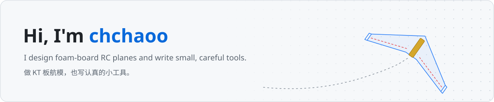

✈️ Foam-board RC planes &nbsp;·&nbsp; 🛠️ Small tools for Windows &nbsp;·&nbsp; 🎮 The occasional game

## 📌 Projects · 项目

<table>
<tr>
<td width="50%" valign="top">

### [sha256-folder-verify](https://github.com/chchaoo/sha256-folder-verify)

Copied a folder? Prove the copy is byte-for-byte identical. One double-clickable `.bat`: SHA-256 of every file, per-file progress, resumable.

复制完文件夹，确认副本和原件逐字节一致。一个双击就能用的 `.bat`。

  

</td>
<td width="50%" valign="top">

### [RCPlane-SU27](https://github.com/chchaoo/RCPlane-SU27)

A Su-27 cut from one sheet of 5 mm foam board, ducted-fan or propeller version. About ¥3 of board and 15 minutes to build.

一张 KT 板切出来的苏-27，涵道版 / 螺旋桨版，板材约 3 元，15 分钟拼好。

  

</td>
</tr>
<tr>
<td width="50%" valign="top">

### [Modified-FTVersaWing](https://github.com/chchaoo/Modified-FTVersaWing)

A flying wing based on the Flite Test Versa Wing, with a laser-cut wooden bay for FPV gear. Tractor or pusher.

改进版 FT 叛逆者飞翼，带木质 FPV 机舱，前拉 / 尾推任选。

  

</td>
<td width="50%" valign="top">

### [MazeSolver-Astar](https://github.com/chchaoo/MazeSolver-Astar)

Guide the sheep home through a random maze in 40 steps. Stuck? The Help button asks A* for the way.

带小羊走出随机迷宫，走不出去就让 A* 算法帮你找路。

  

</td>
</tr>
</table>

## ✈️ Plane plans at a glance · 飞机图纸一览

| | Material · 材料 | Sheet · 板材 | Board cost · 成本 | Build time · 拼装 | Versions · 版本 |
|---|---|---|---|---|---|
| [**Su-27**](https://github.com/chchaoo/RCPlane-SU27) | 5 mm foam board | 1100 / 1200 × 900 mm | ≈ ¥3 | ≈ 15 min | EDF · propeller |
| [**FT Versa Wing, modified**](https://github.com/chchaoo/Modified-FTVersaWing) | 5 mm foam board + 2 mm plywood | 1200 × 900 mm | ≈ ¥5 | ≈ 30 min | tractor · pusher · FPV |

All plans are DXF files in millimetres, ready for a laser cutter or for printing at 1:1.
所有图纸都是以毫米为单位的 DXF 文件，可以直接激光切割，也可以 1:1 打印后手工切。

## 🧰 What I work with · 常用工具

