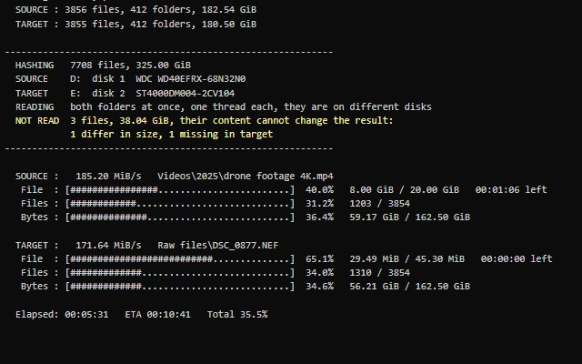
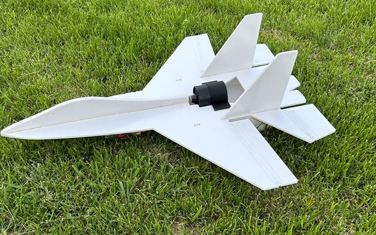
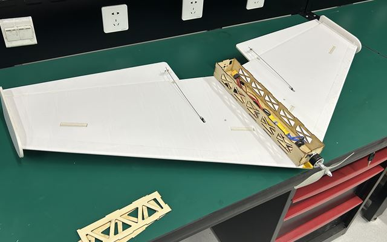

<!-- This page is generated from profile.json by scripts/build.mjs. Edit profile.json, not this file: changes here are overwritten. See EDITING.md. -->

✈️ Foam-board RC planes &nbsp;·&nbsp; 🛠️ Small tools for Windows &nbsp;·&nbsp; 🎮 The occasional game

## 📌 Projects · 项目

<table>
<tr>
<td width="50%" valign="top">

### [sha256-folder-verify](https://github.com/chchaoo/sha256-folder-verify)

Copied a folder? Prove the copy is byte-for-byte identical. One double-clickable `.bat`: SHA-256 of every file, per-file progress, resumable.

复制完文件夹，确认副本和原件逐字节一致。一个双击就能用的 `.bat`。

    

</td>
<td width="50%" valign="top">

### [MazeSolver-Astar](https://github.com/chchaoo/MazeSolver-Astar)

Guide the sheep home through a random maze in 40 steps. Stuck? The Help button asks A\* for the way.

带小羊走出随机迷宫，走不出去就让 A\* 算法帮你找路。

    

</td>
</tr>
<tr>
<td width="50%" valign="top">

### [RCPlane-SU27](https://github.com/chchaoo/RCPlane-SU27)

A Su-27 cut from one sheet of 5 mm foam board, ducted-fan or propeller version. About ¥3 of board and 15 minutes to build.

一张 KT 板切出来的苏-27，涵道版 / 螺旋桨版，板材约 3 元，15 分钟拼好。

   

</td>
<td width="50%" valign="top">

### [Modified-FTVersaWing](https://github.com/chchaoo/Modified-FTVersaWing)

A flying wing based on the Flite Test Versa Wing, with a laser-cut wooden bay for FPV gear. Tractor or pusher.

改进版 FT 叛逆者飞翼，带木质 FPV 机舱，前拉 / 尾推任选。

   

</td>
</tr>
</table>

## ✈️ Plane plans at a glance · 飞机图纸一览

| | Material · 材料 | Sheet · 板材 | Board cost · 成本 | Build time · 拼装 | Versions · 版本 |
|---|---|---|---|---|---|
| [**Su-27**](https://github.com/chchaoo/RCPlane-SU27) | 5 mm foam board | 1100 / 1200 × 900 mm | ≈ ¥3 | ≈ 15 min | EDF · propeller |
| [**FT Versa Wing, modified**](https://github.com/chchaoo/Modified-FTVersaWing) | 5 mm foam board + 2 mm plywood | 1200 × 900 mm | ≈ ¥5 | ≈ 30 min | tractor · pusher · FPV |

All plans are DXF files in millimetres, ready for a laser cutter or for printing at 1:1. 
所有图纸都是以毫米为单位的 DXF 文件，可以直接激光切割，也可以 1:1 打印后手工切。

## 🛤️ Build log · 制作历程

## 🚀 Latest releases · 最新发布

- **[RCPlane-SU27](https://github.com/chchaoo/RCPlane-SU27)** · [Su-27 plans · EDF v4 + propeller v7 · 图纸](https://github.com/chchaoo/RCPlane-SU27/releases/tag/v7) · 2026-09-24
- **[Modified-FTVersaWing](https://github.com/chchaoo/Modified-FTVersaWing)** · [Versa Wing plans v2 · 图纸 v2](https://github.com/chchaoo/Modified-FTVersaWing/releases/tag/v2) · 2026-09-24
- **[sha256-folder-verify](https://github.com/chchaoo/sha256-folder-verify)** · [v14 · Skip files that cannot change the result](https://github.com/chchaoo/sha256-folder-verify/releases/tag/v14) · 2026-09-24

## 📊 By the numbers · 数据

## 🐍 Contributions · 贡献

<picture>
  <source media="(prefers-color-scheme: dark)" srcset="https://raw.githubusercontent.com/chchaoo/chchaoo/output/github-snake-dark.svg">
  
</picture>

The pictures on this page are redrawn every six hours by <a href="scripts/build.mjs">a small script</a> in this repository, from my public GitHub data. 本页图表由仓库里的脚本每六小时根据公开数据重新绘制。

